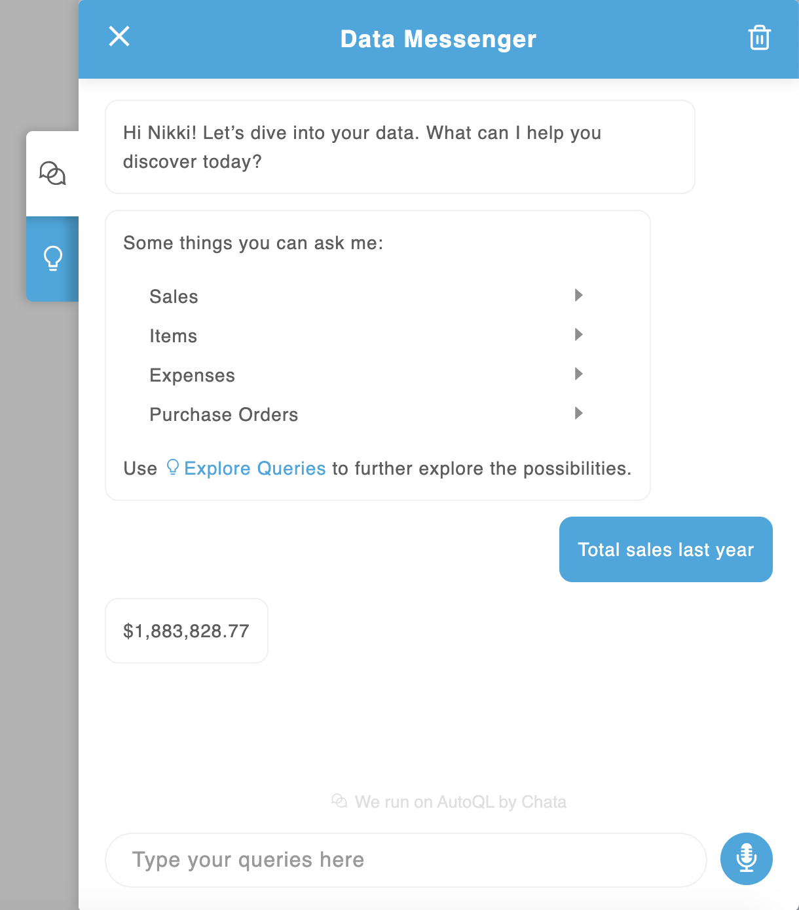
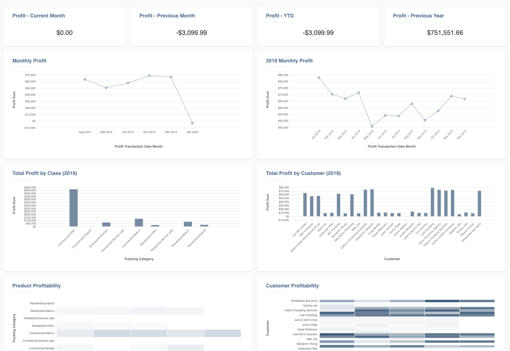
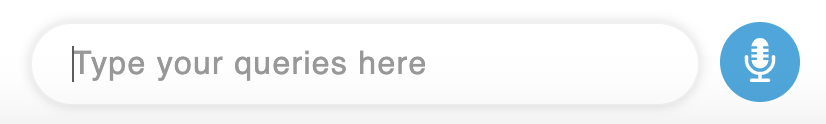
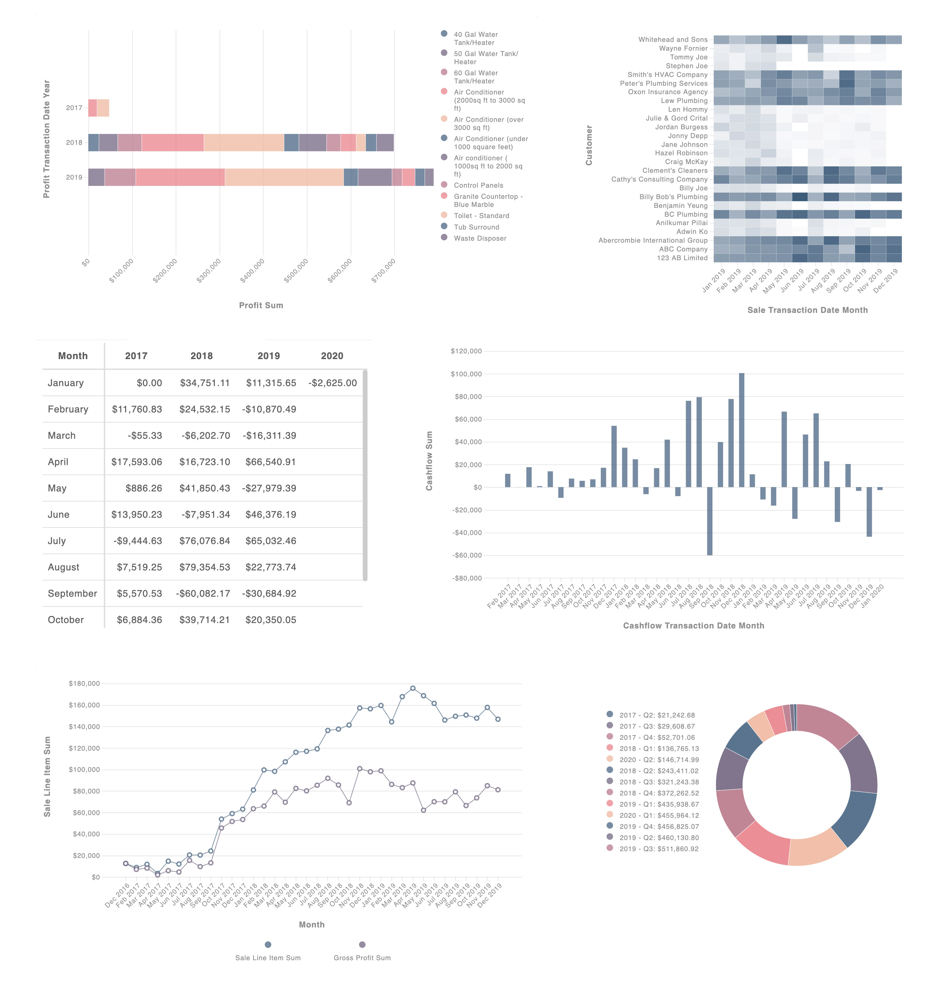

<h1 align="center"></h1>
<h3 align="center"><b>React Components for AutoQL</b></h3>
<p align="center">
  <a href="https://badge.fury.io/js/react-autoql"></a>
  <a>
    
  </a>
  <a href="https://snyk.io/test/github/chatatechnologies/react-autoql">
    
  </a>
</p>
<p align="center">
  <a href="https://github.com/semantic-release/semantic-release">
    
  </a>
  <a href="http://commitizen.github.io/cz-cli/">
    
  </a>
</p>

<!-- []() -->

# Documentation

Full documentation can be found [here](https://chata.readme.io/docs/autoql-react-widgets)

# Demo

A live demo can be found [here](https://chata-ai-test-page-prod.herokuapp.com/)

# Components

### DataMessenger

Deliver the power of AutoQL to your users through Data Messenger, a state-of-the-art conversational interface you can easily build into your existing application.



### Dashboard

Democratize the data in your application and deliver extended reporting and analytics capabilities to all your users with Dashboards you can build and deploy in a snap.



### QueryInput

Query Input is an input box component that can be placed anywhere in the DOM. The QueryInput component works together with the QueryOutput component to automatically handle certain interactions with the data.



### QueryOutput

Query Output is a data visualization widget that accepts the response from our API's query endpoint.



# Quick Start

Using npm:

```
$ npm install react-autoql
```

Using yarn:

```
$ yarn add react-autoql
```

Import the component and the stylesheet

```
import { DataMessenger } from 'react-autoql';

import 'react-autoql/dist/autoql.esm.css'
```

Render the component and control the visibility

```
export default class App extends Component {
  state = {
    isVisible: false
  }

  onHandleClick = () => {
    this.setState({
      isVisible: !this.state.isVisible
    })
  }

  render = () => {
    return (
      <DataMessenger
        isVisible={this.state.isVisible}
        onHandleClick={this.onHandleClick}
        authentication={{
          apiKey: "your-api-key"
          domain: "https://yourdomain.com"
          token: "yourToken"
        }}
      />
    )
  }
}
```
